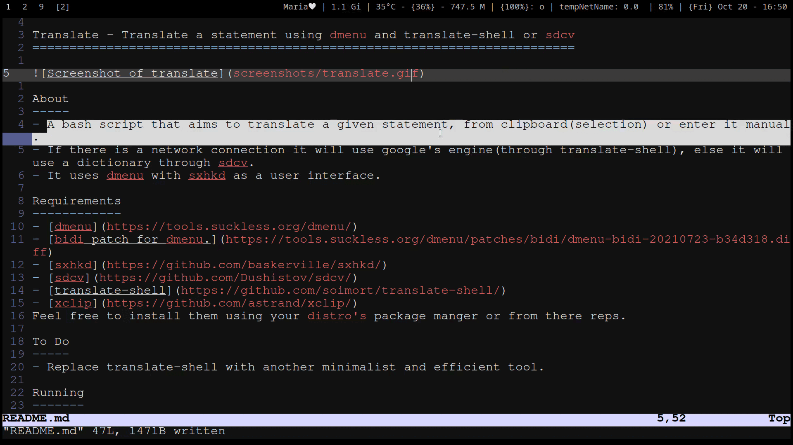

translate - Translate statements using dmenu with translate-shell or sdcv 
=========================================================================



About
-----
- A bash script that aims to translate given statements, from clipboard(selection) or enter them manual.
- If there is a network connection it will use google's engine(through translate-shell), else it will use a dictionary through sdcv.
- It uses dmenu with sxhkd as a user interface. 
  
Requirements
------------
- [dmenu](https://tools.suckless.org/dmenu/) with [bidi](https://tools.suckless.org/dmenu/patches/bidi/dmenu-bidi-20210723-b34d318.diff) patch.
- [sxhkd](https://github.com/baskerville/sxhkd/)
- [sdcv](https://github.com/Dushistov/sdcv/)
- [translate-shell](https://github.com/soimort/translate-shell/)
- [xclip](https://github.com/astrand/xclip/)

Feel free to install them using your distro's package manager or from there repos.

To Do
-----
- Replace translate-shell with another minimalist and efficient tool.

Running
-------
- Clone the repo
```
$ git clone https://github.com/mahmoudElshimi/translate.git
```
- Add permission
```
$ cd translate 
$ chmod +x translate
```
- Add the following lines to sxhkdrc file
```
super + shift + t
	/path/to/translate/translate $(xclip -o) 
```

Configuration
-------------
- You can change languages or dictionaries in translate to match your specifications, see trans(1), and sdcv(1). 
